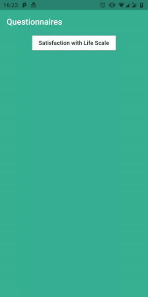
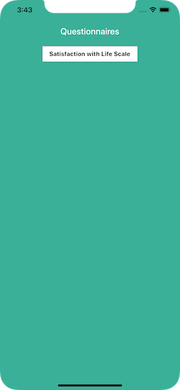
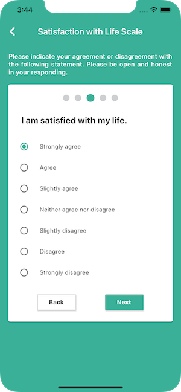
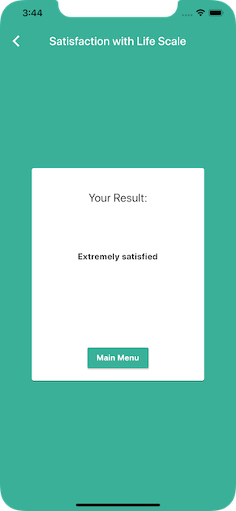

# questionnaires

A Flutter app with psychological questionnaires. Design inspired by [Surveys](https://dribbble.com/shots/3928903-Surveys) by [Shpetim Ujkani](https://dribbble.com/ShpetimUjkani).

## Screenshots

|                       |                              |                              |                              |
| ----------------------|------------------------------|------------------------------|----------------------------- |
|  |  |  |  |

## Questionnaires

### Satisfaction with Life Scale

> A 5-item scale designed to measure global cognitive judgments of one’s life satisfaction (not a measure of either positive or negative affect). Participants indicate how much they agree or disagree with each of the 5 items using a 7-point scale that ranges from 7 strongly agree to 1 strongly disagree.

Diener, E., Emmons, R. A., Larsen, R. J., & Griffin, S. (1985). The Satisfaction with Life Scale. Journal of Personality Assessment, 49, 71-75.

## UML Class Diagram

## Technical Info

- There are three screens in the app.
    - `HomeScreen` contains a button to load the chosen questionnaire.
    - `QuestionnaireScreen` displays the questionnaire which consists of multiple questions shown one at a time.
    - `ResultScreen`shows the user's questionnaire result.
- `setState` is used as the project's state management solution.
- `QuestionnaireService` loads a list of `Questionnaire` models from json.
- The code architecture was designed so that a new questionnaire can be incorporated into the app by simply adding an additional json file.
